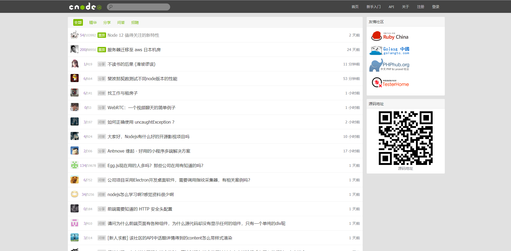
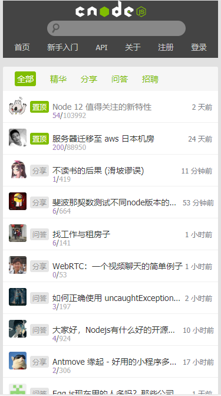

# cnodejs 项目
使用 vue cli + vue router + axios 等技术利用 CNode社区提供的 API 实现





## 项目特点
* 网页利用 CSS @media 同时支持PC端和移动端查看
* 使用 vue router 实现路由之间跳转及数据传递
* 使用 vue component 实现首页的分页组件
* 自定义 Loading 组件实现数据请求的加载动画，提高用户体验

## 如何运行
```
# 1.安装依赖
npm install
# 2.开发环境运行
npm run serve
# 3.生产环境运行
npm run build

```
